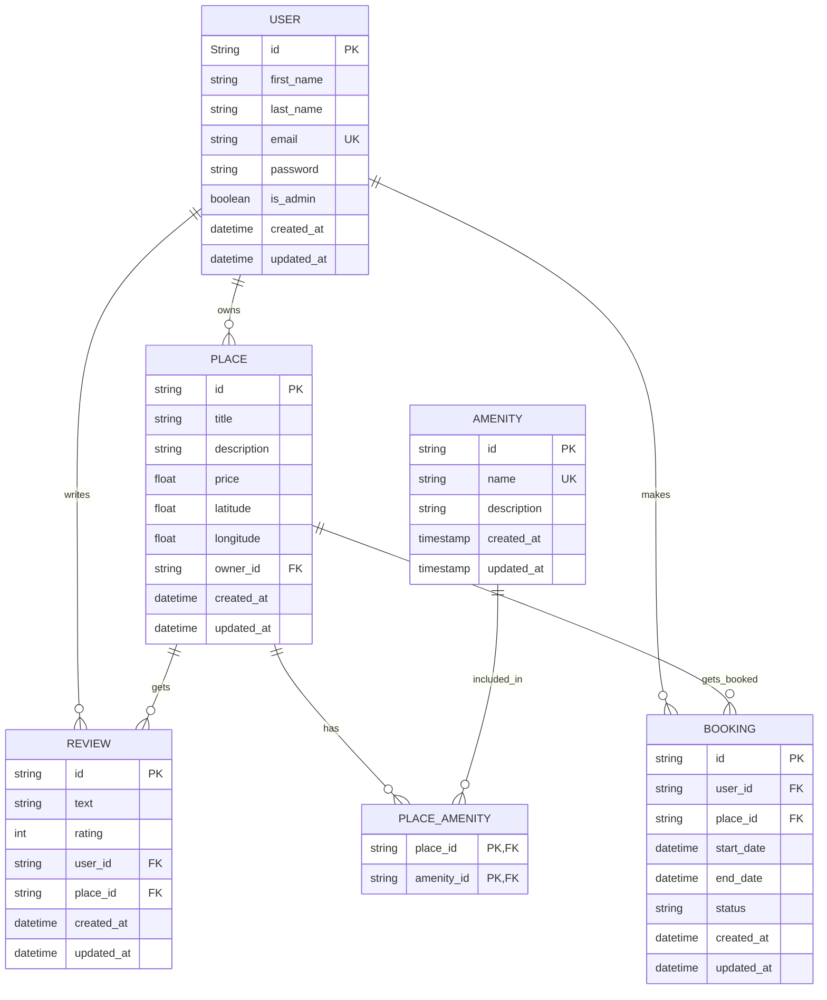

# HBnB - Database ER Diagram 

```mermaid
erDiagram
  USER ||--o{ PLACE : owns
  USER ||--o{ REVIEW : writes
  PLACE ||--o{ REVIEW : gets
  PLACE ||--o{ PLACE_AMENITY : has
  AMENITY ||--o{ PLACE_AMENITY : included_in
  USER ||--o{ BOOKING : makes
  PLACE ||--o{ BOOKING : gets_booked

  USER {
    String id PK
    string first_name
    string last_name
    string email UK
    string password
    boolean is_admin
    datetime created_at
    datetime updated_at
  }
  PLACE {
    string id PK
    string title
    string description
    float price
    float latitude
    float longitude
    string owner_id FK
    datetime created_at
    datetime updated_at
  }
  REVIEW {
    string id PK
    string text
    int rating
    string user_id FK
    string place_id FK
    datetime created_at
    datetime updated_at
  }
  AMENITY {
    string id PK
    string name UK
    string description
    timestamp created_at
    timestamp updated_at
  }
  PLACE_AMENITY {
    string place_id PK,FK
    string amenity_id PK,FK
  }
  BOOKING {
    string id PK
    string user_id FK
    string place_id FK
    datetime start_date
    datetime end_date
    string status
    datetime created_at
    datetime updated_at
  }
```
